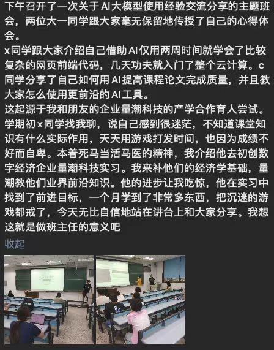

# 量潮与西交老师的合作机制
量潮科技和西安交大经院的合作主要是以量潮创始人张果和西交经院樊仲琛老师的个人合作为起点，逐步扩展到各自的组织参与。

## 第一阶段：学术合作
张果和樊仲琛老师通过知乎大V群认识，共同合作在数据经济学领域提出一些想法，主要围绕数据如何定价、数据资产如何估值等经济问题，初步建立了合作基础。

## 第二阶段：校企联培
西安交大经院x同学，去年大一、今年大二，曾经挂科几乎所有的科目接近退学，找到大一的班主任樊老师说希望改变，于是樊老师介绍到了量潮实习。加入一两个月以后，x同学就因为有了目标以后有了学习的动力，当学期就过了上学期和本学期的全部考试，大二已经正常地进行学业。由于x同学转变过于惊人，樊老师在院系大会上反复受到了院党委书记等院领导的表扬。

樊老师还不定期地根据公司提出的经济学教学需求，为公司的实习生们开设每周一次的经济学小灶。
## 第三阶段：项目合作
樊老师和其他老师有科研项目，向量潮科研服务业务下单处理数据。x的技术能力和管理能力都在不断精进，逐渐一步一步成长，从项目参与者、项目主程到直接代表公司对接的项目负责人。樊老师还邀请x同学给他的助研团队授课讲解API调用大语言模型等AIGC编程知识，公司负责教研和督导。
樊老师也在自己的经济学小灶上给公司的实习生们解释他们的研究动机和研究思路，以方便他们更好地参与项目。
## 第四阶段：创赛合作
在樊老师的介绍下，x同学大二分流进入的电商系的系主任王乐老师和新班主任刘晓敏老师和公司建立了长期合作意向。双方以组建创赛团队的形式，联合组建起一个产学研实训基地，由公司主导日常运营，老师们负责创新创业比赛，张果担任企业导师，几位老师担任高校导师，x同学担任参赛队长，通过内推的形式招募了一批西交的同学，同时公司也和自己的合作社群以内推的形式从全国范围内招募了另外一批同学共同参与。量潮和浙理工计算机系生产实习课程的实训合作目前也在此基地下统一管理。实训基地整体暂时以“量潮创赛”的名义对外合作，未来可能会考虑在西交经院电商系正式挂牌。
## 第五阶段：联盟机制
为了方便统筹和协商各项产学研合作事务，公司主导并联合战略合作伙伴成立了“量潮创新联盟”，主要职能是建设联盟管理制度和工作机制。其中，工作机制来源于我们和各个战略合作伙伴建立的合作项目，包括校企合作机制、学术合作机制、开源合作机制等。联盟管理制度主要来源于公司制度，通过联盟议事协调机制梳理公司和联盟的各项管理，并向其他战略合作伙伴输出制度。樊老师把量潮形成的实习生管理实践运用在了自己的助研项目中，在x同学的协助下，大大提高了自己的管理效率，更好地完成自己的育人目标。

